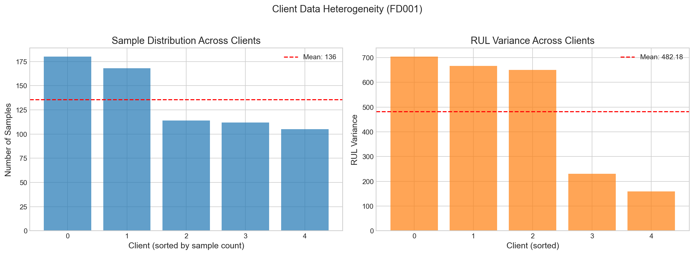
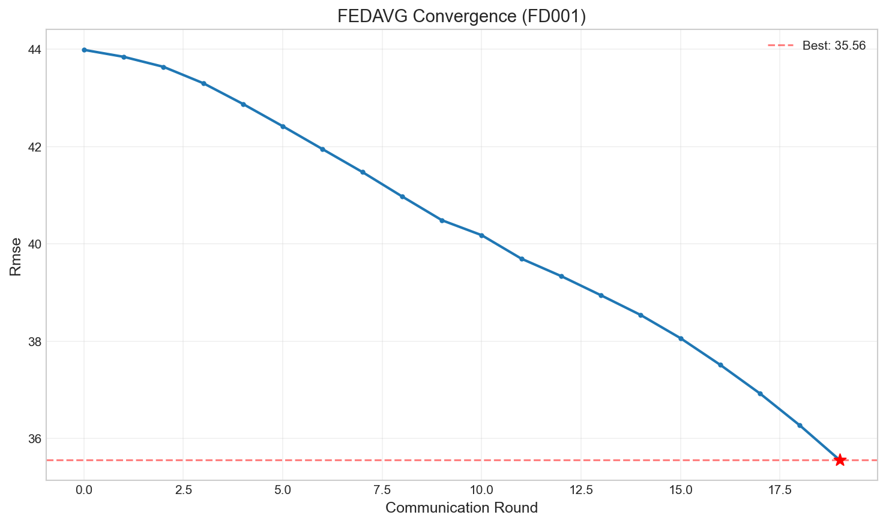
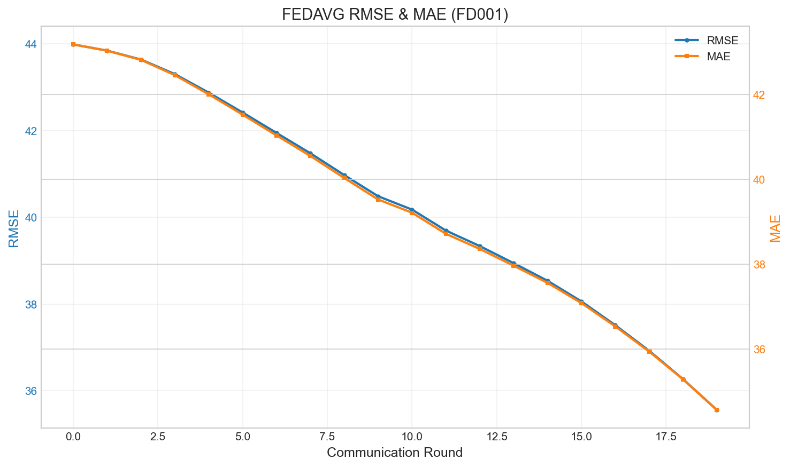

# FEDAVG Experiment Report — FD001

**Experiment ID:** `demo_fedavg_20260117_231423_5a820de0`  
**Generated:** 2026-01-17 23:16:00  
**Author:** FL Experiment Runner

---

## 1. Configuration Summary

| Parameter | Value |
|-----------|-------|
| Algorithm | fedavg |
| Dataset | FD001 |
| Rounds | 20 |
| Local Epochs | 1 |
| Batch Size | 64 |
| Learning Rate | 0.001 |
| Participation | 100% |
| Num Clients | 5 |
| Seed | 42 |

---

## 2. Final Results

| Metric | Value |
|--------|-------|
| **Test RMSE** | **11.36** |
| **Test MAE** | **9.54** |
| Total Time | 0.0s |
| Avg Round Time | 0.00s |

---

## 3. Convergence Analysis

Training completed **20** rounds.

- **Initial RMSE:** 43.99
- **Final RMSE:** 35.56
- **Best RMSE:** 35.56 (Round 20)
- **Improvement:** 8.43 (19.2%)

### Plots

---

## 4. Data Distribution (Non-IID)

| Statistic | Value |
|-----------|-------|
| Num Clients | 5 |
| Total Samples | 679 |
| Min Samples/Client | 105 |
| Max Samples/Client | 180 |
| Mean Samples/Client | 135.8 |
| Std Samples/Client | 35.3 |
| Mean RUL Range | [94.1, 118.7] |

---

## 5. Files & Artifacts

### Logs
- [rounds.csv](../logs/rounds.csv) — Round-wise metrics
- [non_iid.csv](../logs/non_iid.csv) — Per-client data statistics
- [summary.json](../logs/summary.json) — Final experiment summary

### Model
- [final_model.pt](../final_model.pt) — Final global model checkpoint

### Configuration
- [config.json](../config.json) — Full experiment configuration

---

*Report generated automatically by FL Experiment Runner*
