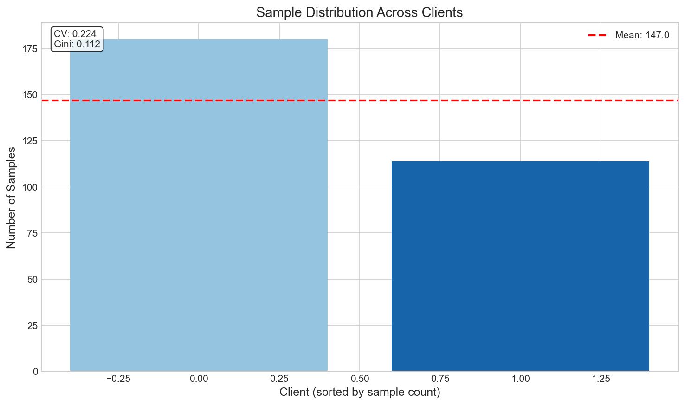
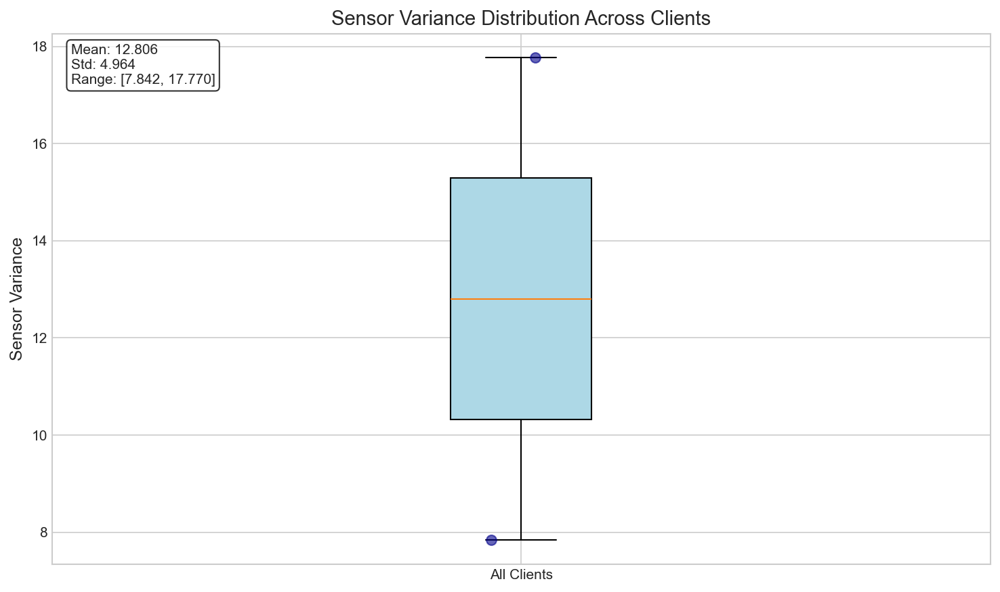
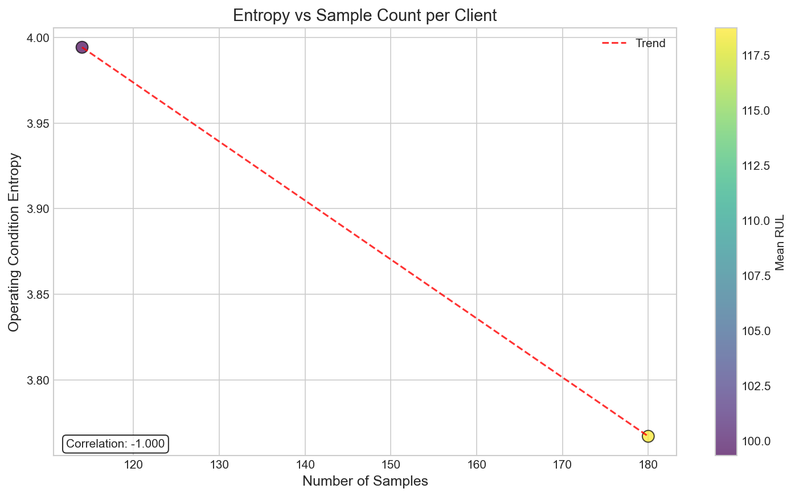
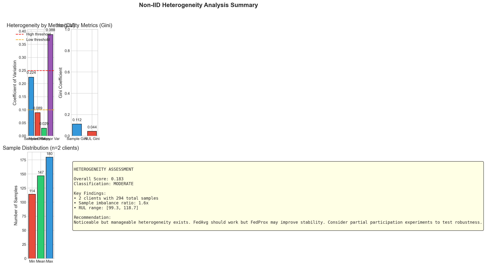

# Non-IID Audit Report — FD001

**Generated:** 2026-01-17 23:49:45

---

## Executive Summary

| Question | Answer |
|----------|--------|
| **Is data non-IID?** | Yes |
| **How strong is heterogeneity?** | MODERATE (Score: 0.183) |
| **Which algorithms are justified?** | FedAvg, FedProx |

---

## 1. Sample Distribution Analysis

| Metric | Value |
|--------|-------|
| Client Count | 2 |
| Total Samples | 294 |
| Min Samples | 114 |
| Max Samples | 180 |
| Mean Samples | 147.0 |
| Std Samples | 33.0 |
| Coefficient of Variation | 0.224 |
| Gini Coefficient | 0.112 |
| Imbalance Ratio | 1.58x |

**Interpretation:** Sample distribution is relatively balanced.

---

## 2. RUL Distribution Analysis

| Metric | Value |
|--------|-------|
| Mean RUL Range | [99.3, 118.7] |
| Mean RUL Average | 109.0 |
| Mean RUL Std | 9.7 |
| Mean RUL CV | 0.089 |
| Mean RUL Gini | 0.044 |
| Variance Average | 404.7 |

**Interpretation:** Label distribution is relatively uniform.

---

## 3. Operating Condition Analysis

| Metric | Value |
|--------|-------|
| Entropy Min | 3.767 |
| Entropy Max | 3.994 |
| Entropy Mean | 3.881 |
| Entropy CV | 0.029 |

**Interpretation:** Operating conditions are similar across clients.

---

## 4. Sensor Variance Analysis

| Metric | Value |
|--------|-------|
| Mean | 12.8060 |
| Std | 4.9639 |
| CV | 0.388 |
| Range | [7.8421, 17.7698] |

---

## 5. Algorithm Recommendations

| Algorithm | Recommendation | Priority | Notes |
|-----------|---------------|----------|-------|
| FedAvg | Recommended | 1 | Low heterogeneity makes FedAvg a good choice |
| FedProx | Recommended | 2 | Proximal term helps with moderate heterogeneity (CV=0.18) |
| SCAFFOLD | Optional | 3 | Overhead may not be justified for low heterogeneity |
| FedDC | Optional | 4 | Consider if SCAFFOLD doesn't meet performance targets |

---

## 6. Conclusion

### Heterogeneity Classification: **MODERATE**

Noticeable but manageable heterogeneity exists. FedAvg should work but FedProx may improve stability. Consider partial participation experiments to test robustness.

### Recommended Experimental Protocol

1. **Baseline:** Run FedAvg to establish baseline performance
2. **Primary:** Run FedProx for moderate improvement
3. **Comparison:** Test across participation rates (100%, 70%, 50%)
4. **Validation:** Use held-out test data for final evaluation

---

## Plots

---

*Report generated by FL-CMAPSS Non-IID Audit Module (RX-0)*
